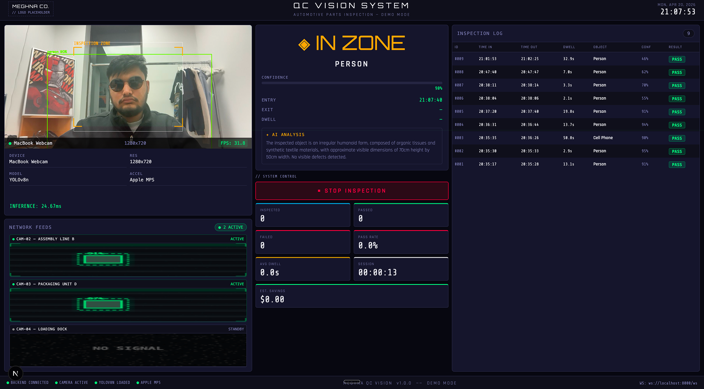

# Meghna QC Vision System



An enterprise-grade, real-time Computer Vision Quality Control system. It uses a Next.js front-end and a Python/FastAPI backend powered by YOLOv8 for object detection and Google's Gemini 2.5 Flash for LLM-based anomaly analysis.

## Features

- **Real-Time Object Detection**: Uses YOLOv8n to identify objects instantly from video feeds at 30+ FPS.
- **AI Anomaly Analysis**: Intercepts items in the inspection zone and pipes the cropped frame to Google Gemini 2.5 Flash for natural-language anomaly detection.
- **Interactive Inspection Zones**: Fully drag-and-drop boundary zones over the camera feed that instantly update the backend tracking system.
- **Financial Return Metrics**: Live-calculating dashboards indicating passed/failed objects and estimated savings.
- **Simulated Multi-Camera Scale**: Animated network feeds to demonstrate factory-scale deployment readiness.

## How to Run Locally

You will need **two separate terminal windows**.

### 1. Start the Backend (AI & Camera)
```bash
# Navigate to the backend folder
cd backend

# Activate the virtual environment
source venv/bin/activate

# Install requirements (if not done)
# pip install -r requirements.txt

# Start the server
uvicorn main:app --host 0.0.0.0 --port 8000 --reload
```

### 2. Start the Frontend (UI Dashboard)
```bash
# Navigate to the frontend folder
cd frontend

# Install dependencies (if not done)
# npm install

# Start the development server
npm run dev
```

### 3. Open the App
Go to [http://localhost:3000](http://localhost:3000)

## Configuration
Requires a valid `GEMINI_API_KEY` in `backend/.env`. See `backend/.env.example` for details.
