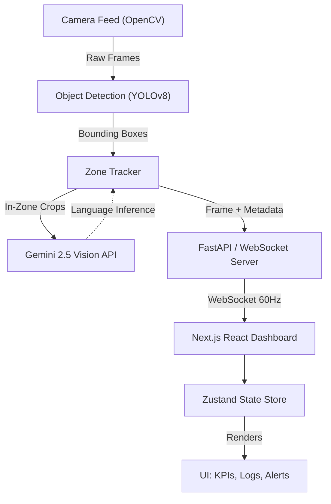

# Meghna QC Vision System


An enterprise-grade, real-time Computer Vision Quality Control system. It bridges the gap between hardware-accelerated object detection and advanced Large Language Model (LLM) intelligence to create a fully autonomous, highly scalable inspection pipeline for modern manufacturing and assembly environments.

## 🚀 The Problem & What It Overcomes
Traditional Quality Control (QC) relies heavily on either manual human inspection (which is slow, error-prone, and unscalable) or rigid, hard-coded optical systems that fail if lighting changes or objects rotate slightly. 

**Meghna QC Vision overcomes these limitations by combining:**
*   **Hardware-accelerated edge AI (YOLOv8)** for millisecond-latency object tracking—replacing rigid, rule-based optical scanners.
*   **Generative AI (Gemini Flash)** for zero-shot anomaly detection—allowing the system to understand "why" something is a defect without needing 10,000 manually labeled defect images.
*   **Immediate Financial ROI Tracking**—translating technical AI metrics directly into business value on the shop floor. 

## ✨ Special Features
*   **Real-Time Sub-30ms Object Detection**: Powered by YOLOv8n running directly on local hardware (Apple MPS / CUDA accelerated), processing camera feeds at 30+ FPS instantly.
*   **Generative AI Anomaly Analysis**: When an object is trapped in the inspection zone, the cropped frame is instantly piped to Google Gemini 2.5 Flash, generating a natural-language description and identifying subtle defects—a feat impossible with standard bounding-box models alone.
*   **Interactive Spatial Calibration**: Fully dynamic, drag-and-drop inspection zone configuration directly over the live video feed. This syncs to the Python backend via WebSockets without requiring a system restart.
*   **Enterprise Financial Dashboard**: Live-calculating KPI metrics, capturing pass/fail rates, session times, and computing an estimated dollar-value savings (based on human-labor offset) dynamically.
*   **Auditory Alert Synthesis**: Features localized Web Audio API integration to trigger native, hardware-level alarms when critical anomalies (FAIL) are detected.
*   **Simulated Multi-Camera Scale**: Animated network feeds demonstrating factory-scale deployment readiness and multi-tenant feed monitoring capabilities.

## 🏗️ System Architecture

The platform operates on a decoupled, bi-directional architecture ensuring high-throughput inference without blocking the UI thread.



## 🔮 Future Roadmap
*   **Custom Defect Modeling**: Moving from generic COCO-80 classes to hyper-specific YOLO fine-tuning (e.g., detecting micro-scratches on PCBs or missing screws on assembly lines) via Roboflow integration.
*   **Time-Series Analytics & Exporting**: Plotting pass/fail trends over a 30-day window and allowing PDF/CSV automated export reports for floor managers.
*   **Edge TPU Deployment**: Optimizing the backend to run in completely offline edge environments using Coral TPUs or Nvidia Jetson Nanos.
*   **Cloud Data Aggregation**: Piping WebSocket data to AWS IoT Core or Google Cloud BigQuery for fleet-level, multi-factory analytics.

---

## 🛠️ How to Run Locally

You will need **two separate terminal windows**.

### 1. Start the Backend (AI & Camera)
```bash
# Navigate to the backend folder
cd backend

# Activate the virtual environment
source venv/bin/activate

# Install requirements (if not done)
# pip install -r requirements.txt

# Start the server
uvicorn main:app --host 0.0.0.0 --port 8000 --reload
```

### 2. Start the Frontend (UI Dashboard)
```bash
# Navigate to the frontend folder
cd frontend

# Install dependencies (if not done)
# npm install

# Start the development server
npm run dev
```

### 3. Open the App
Go to [http://localhost:3000](http://localhost:3000)

## Configuration
Requires a valid `GEMINI_API_KEY` in `backend/.env`. See `backend/.env.example` for details.
